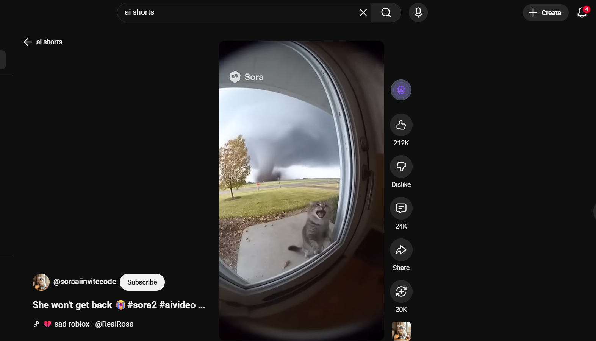
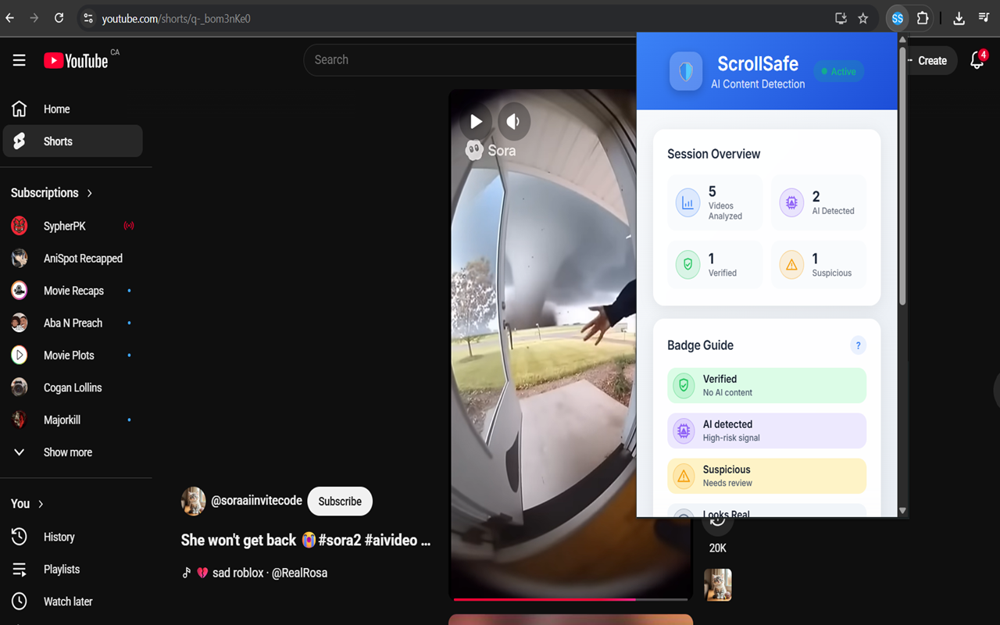
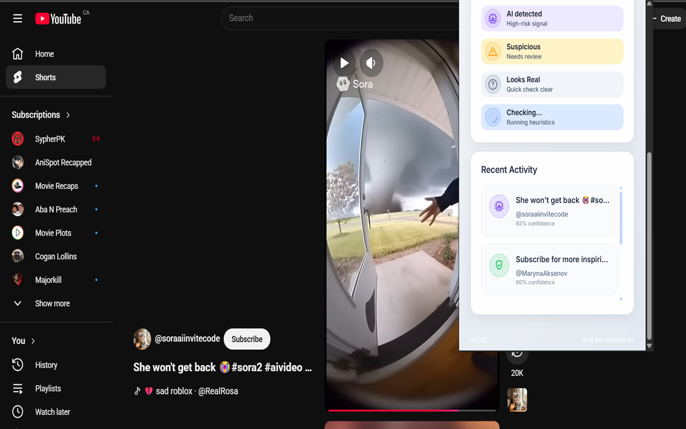
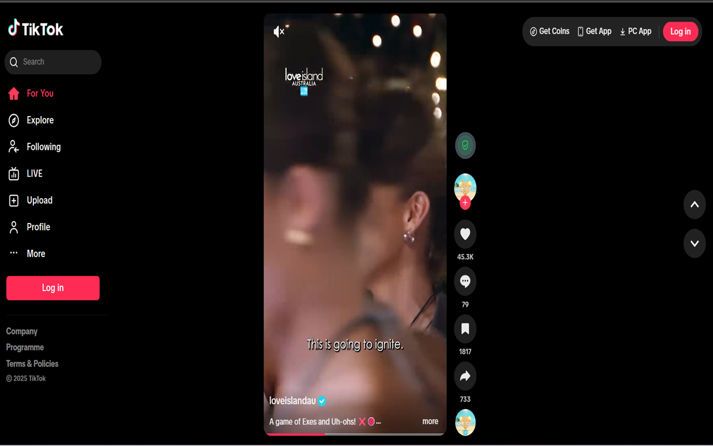
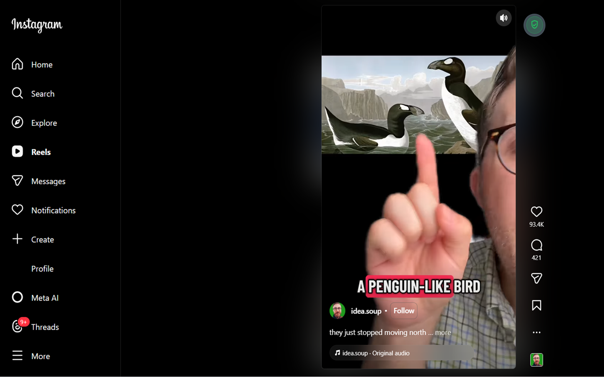

# ScrollSafe Monorepo

ScrollSafe is a full-stack system that flags likely AI-generated short-form videos in real time. It combines a Chrome extension, FastAPI services, Redis/Celery workers, residential resolvers, and a Hugging Face inference endpoint to overlay trustworthy signals on YouTube Shorts, Instagram Reels, and other feeds while you browse. This repository is the home for all future ScrollSafe development and the project I present to recruiters.

> **Recognition:** Built for Google Developer Group Windsor's **Innovate with AI** challenge (107 participants / 15 teams). ScrollSafe was selected as one of 6 finalists to demo live on Nov 7 and won **2nd place** during GDG DevFest on Nov 8. Demo + write-up: [Devpost](https://devpost.com/software/scrollsafe?ref_content=my-projects-tab&ref_feature=my_projects).
>
> **Stable Release (YouTube-first):** The publicly shared v1 Chrome extension-which is the version most recruiters will evaluate-focuses on YouTube Shorts and is proven stable there. It is available on GitHub releases as a packed `.rar` for manual loading: [ScrollSafe Chrome Extension v1.0.0](https://github.com/GitHubguy97/ScrollSafe-chrome-extension/releases/tag/v1.0.0). Instagram Reels and TikTok adapters are in active development inside this monorepo. Once those implementations are production-ready, we plan to publish ScrollSafe to the Chrome Web Store so users can install updates seamlessly.

---

## System Design (At a Glance)

<p align="center">
  
</p>

- Chrome extension injects a badge into YouTube Shorts, Instagram Reels, and TikTok, then coordinates heuristics + optional deep scans.
- FastAPI backend handles heuristics (`/api/analyze`), deep-scan job orchestration, admin metrics, and caching (Redis/Postgres).
- Celery workers run deep scans over captured frames and call a SwinV2 inference endpoint (GPU/CPU), writing results back to Redis.

---

## Product Screenshots

<p align="center">
  
  
</p>

<p align="center">
  
  
</p>

<p align="center">
  
  
</p>

---

## Why ScrollSafe

- **Problem:** Short-form platforms are saturated with synthetic media and deepfakes. Viewers have no contextual signal, and existing research tools disrupt browsing.
- **Approach:** Embed a subtle badge that runs low-latency heuristics on-scroll. When users need higher confidence, trigger a *deep scan* that extracts canonical frames server-side, classifies them via a SwinV2 model, and feeds the verdict back to the badge.
- **Impact (MVP):**
  - ~80% internal accuracy on test clips (AI vs real).
  - 100% badge attach reliability across YouTube Shorts QA runs.
  - ~80% reduction in heuristics API calls via debounce + caching.
  - Async deep scans with Redis queues & Celery workers ensure responsive UX even during bursts.

---

## Repository Layout

| Path | Description |
| --- | --- |
| `scrollsafe-frontend/` | Chrome Extension (Manifest V3) content scripts, adapters (YouTube, Instagram, TikTok), badge UI, and background service worker that proxies API requests and captures frames. |
| `scrollsafe-backend/` | FastAPI service exposing heuristics + deep scan APIs, admin metrics, and cache/database integration (Redis/Postgres). Includes Celery job helpers and heuristics. |
| `resolver/` | Residential resolver tooling that runs `yt-dlp → ffmpeg` frame capture behind a Cloudflare tunnel to avoid cloud IP throttling; provides proxy-aware pipelines and local smoke tests. |
| `scrollsafe-doomscroller/` | Discovery/analyzer workers, DB schema, and scripts that crawl trending shorts, run batch inference, and backfill caches (“doomscroller pipeline”). |
| `scrollsafe-inference-api/` | FastAPI inference endpoint that batches frames and serves the fine-tuned `haywoodsloan/ai-image-detector-dev-deploy` SwinV2 model (GPU-friendly). |
| `scrollsafe-inference-api-cpu/` | CPU-optimized variant of the inference API for low-cost deployments. |
| `out/`, `test/` | Local artifacts and system tests (ignored in git). |

---

## Key Features

- **On-scroll heuristics badge:** MutationObservers watch dynamic DOM trees and attach a badge with near-zero latency while you scroll. Metadata heuristics run via FastAPI in ~120 ms.
- **On-demand deep scan:** Clicking the badge triggers a deep scan—background script captures frames or a resolver streams frames from the user’s machine, Celery workers classify them, and the badge updates with “AI detected”, “Suspicious”, or “Verified”.
- **Cross-platform DOM adapters:** Platform-aware selectors, metadata extraction, and mounting logic for YouTube Shorts, Instagram Reels (including /p/ layouts), and TikTok. Each adapter passes video IDs, channels, and captions into the pipeline.
- **Discovery (“doomscroller”) pipeline:** Background workers regularly ingest trending shorts, extract frames server-side, and cache verdicts so most user requests are cache hits.
- **Explainable UI:** Badges show confidence, reasons, and deep-scan progress; session history tracks the most recent analyzed videos.

---

## Architecture Overview

<p align="center">
  
</p>

1. **Chrome Extension (MV3):**
   - Content scripts inject the badge, adapters detect the active video, and the pipeline coordinates heuristics, caching, and deep scans.
   - The background service worker proxies API requests (avoids PNA restrictions) and captures frames via `chrome.tabs.captureVisibleTab`.

2. **Backend API (FastAPI):**
   - `/api/analyze` runs metadata heuristics (`regex` + rules).
   - `/api/deep-scan` enqueues deep scans and returns job IDs.
   - `/api/deep-scan/{job_id}` polls Redis for status/results.
   - Admin endpoints expose queue depth, verdict metrics, and manual overrides.

3. **Task & Data Layer:**
   - **Redis:** Queue + cache; dedupe deep scans; store transient verdicts.
   - **PostgreSQL:** Long-term storage for analyses, admin overrides, telemetry.
   - **Celery Workers:** Deep scans (`yt-dlp → ffmpeg → inference → aggregation`), discovery sweepers, analyzer jobs, and admin-label syncing.

4. **Inference Endpoint:**
   - FastAPI microservice hosting the SwinV2 classifier (GPU or CPU build).
   - Accepts multipart frames, batches inference, returns `{"real": p, "artificial": q}` per frame plus batch timings.

5. **Resolver Apps:**
   - Proxy-aware Python services (with IPRoyal creds & optional cookies) running on a trusted residential device. They expose `/extract-and-infer`, ensuring reliable downloads even when cloud IPs are throttled.

6. **Design Diagram:** See `design.png` (also embedded above) for end-to-end data flow.

---

## Tech Stack

- **Frontend:** JavaScript/TypeScript, Chrome APIs (Manifest V3), DOM APIs (`MutationObserver`, `OffscreenCanvas`).
- **Backend:** Python 3.11, FastAPI, Pydantic, Uvicorn, Celery, Redis, PostgreSQL, requests.
- **Media pipeline:** `yt-dlp`, `ffmpeg`, residential proxies, cookie-based authentication for YouTube.
- **Model Serving:** Hugging Face Transformers (AutoImageProcessor, SwinV2), PyTorch, custom FastAPI inference service.
- **Infra & Tooling:** Docker/Docker Compose, Cloudflare Tunnel, GitHub Actions CI/CD, dotenv, PowerShell scripts for Windows bootstrap.

---

## Challenges & Solutions

| Challenge | Solution |
| --- | --- |
| Dynamic DOMs (YouTube/Instagram re-rendering) | Implemented modular adapters + MutationObservers. The pipeline re-attaches badges, refreshes metadata, and prevents result bleed-over. |
| Cloud IP throttling of `yt-dlp` / `ffmpeg` | Separated frame extraction into the `resolver/` app running on a residential IP via Cloudflare Tunnel. Added progressive-MP4 preference, HLS/DASH fallbacks, cookie-aware retries, and idempotent deep-scan locks. |
| Balancing latency vs. accuracy | Debounced heuristics (2 s), cache-aside (Redis/Postgres), and asynchronous deep scans. Badge always shows immediate heuristics while deep scans run in the background. |
| Frame extraction robustness | Multi-stage extractor: metadata probe → fast path (yt-dlp pipe) → fallback B (direct ffmpeg with headers) → fallback C (temp download). Captures 16 evenly spaced frames per clip. |

---

## Getting Started

1. **Clone & Install**
   ```bash
   git clone <repo-url>
   cd Hackathon-project
   python -m venv .venv && . .venv/Scripts/activate  # or source .venv/bin/activate
   pip install -r scrollsafe-backend/requirements.txt
   ```

2. **Environment**
   - Copy `.env.example` files inside each subproject (frontend uses runtime config).
   - Provide API keys:
     - `YOUTUBE_API_KEY`, `HUGGING_FACE_API_KEY`, `INFER_API_URL`, `ADMIN_API_KEY`.
     - Resolver proxies (e.g., `IPRoyal`) and `YTDLP_COOKIES_FILE`.

3. **Run Backend**
   ```bash
   cd scrollsafe-backend
   uvicorn main:app --reload
   ```

4. **Start Workers / Resolver**
   ```bash
   cd scrollsafe-backend
   celery -A deep_scan.tasks worker -Q deep_scan -l info

   cd ../resolver
   python main_run.py  # smoke-test pipeline / resolver connectivity
   ```

5. **Load Extension**
   - Go to `chrome://extensions`, enable Developer Mode, “Load unpacked” → `scrollsafe-frontend/`.
   - Pin “ScrollSafe” and open YouTube Shorts to see the badge in action.

> **Tip:** For production, deploy the inference API (`scrollsafe-inference-api`), backend, and workers via Docker Compose. Residential resolver can run on a local machine using `start-resolvers.ps1`.

---

## Metrics & Observability

- `scrollsafe-backend/api_requests.log` and `performance.log` capture heuristics latency (decorated via `timing_logger.py`).
- Admin metrics endpoint (`/api/admin/metrics`) exposes queue depth, verdict counts per label, and recent analyses for dashboards.
- Logging is structured (`logger.info`, `logger.warning`) across backend and workers for easy ingestion.

---

## Demo & Media

- Live demo + pitch deck (Innovate with AI finalists): [Devpost Project Page](https://devpost.com/software/scrollsafe?ref_content=my-projects-tab&ref_feature=my_projects).
- System design & flows: embedded `design.png`.
- Additional screenshots, badges, and UI captures are available in `scrollsafe-frontend/icons/` and `design.png`.

---

## Roadmap

1. **Model Enhancements:** Expand dataset with newly labeled clips, add explainability snippets (saliency / textual cues), and support additional modalities (audio cues).
2. **Platform Coverage:** TikTok adapter parity with YouTube/Instagram, plus support for Facebook Reels and Twitter videos.
3. **Rate Limiting & Quotas:** Per-platform throttling, user opt-in analytics, and dashboard for admin overrides.
4. **Reporting & Sharing:** Allow users to share verdict cards, integrate with newsroom workflows, and add contextual education links.
5. **Mobile & Edge:** Explore Firefox/Safari extensions and serverless inference for low-latency bursts.

---

## 30-Second Pitch

> “ScrollSafe is a Chrome extension and backend that flags likely AI-generated short-form videos in real time. I built it end-to-end—extension UI, FastAPI services, Redis/Celery queues, `yt-dlp → ffmpeg` frame extraction, and a SwinV2 inference endpoint. We engineered around cloud IP throttling by tunneling a trusted edge and added resilient fallbacks. The MVP achieved ~80% internal accuracy, 80% fewer heuristics calls via debouncing, and 100% badge attach reliability across QA. We placed **2nd** at GDG Windsor’s Innovate with AI after live demos to judges and DevFest attendees.”

---

## Contact

- **Email:** [jamalag@uwindsor.ca](mailto:jamalag@uwindsor.ca)
- **LinkedIn:** [linkedin.com/in/gideon-i-jamala](https://www.linkedin.com/in/gideon-i-jamala)
- **Demo & write-up:** [Devpost](https://devpost.com/software/scrollsafe?ref_content=my-projects-tab&ref_feature=my_projects)

Thanks for checking out ScrollSafe! Let me know if you’d like a guided walkthrough or deployment assistance.
